<p align="center">
  <a href="https://example.com/">
    
  </a>

  <h3 align="center">熊义</h3>

  <p align="center">
    第二阶段 rust for linux 作业报告
    <br>
</p>


## 索引

- [索引](#索引)
- [作业1-编译Linux内核](#作业1-编译linux内核)
- [作业2-对Linux内核进行一些配置](#作业2-对linux内核进行一些配置)
- [作业3-使用rust编写一个简单的内核模块并运行](#作业3-使用rust编写一个简单的内核模块并运行)
- [作业4-为e1000网卡驱动添加remove代码](#作业4-为e1000网卡驱动添加remove代码)
- [作业5-注册字符设备](#作业5-注册字符设备)
- [结语](#结语)


## 作业1-编译Linux内核

- 生成适用于x86_64架构的默认配置

```bash
cd linux
make x86_64_defconfig
```

- 配置内核对Rust语言的支持

```bash
make LLVM=1 menuconfig
General setup
        ---> [*] Rust support
```
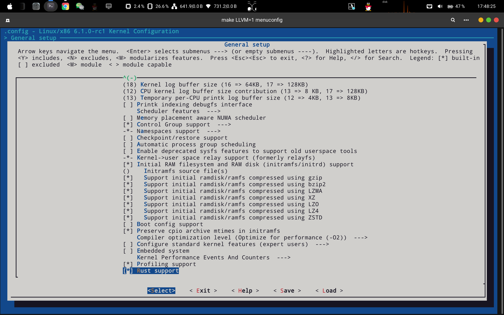

- 编译内核

```bash
make LLVM=1 -j$(nproc)
ls vmlinux
```
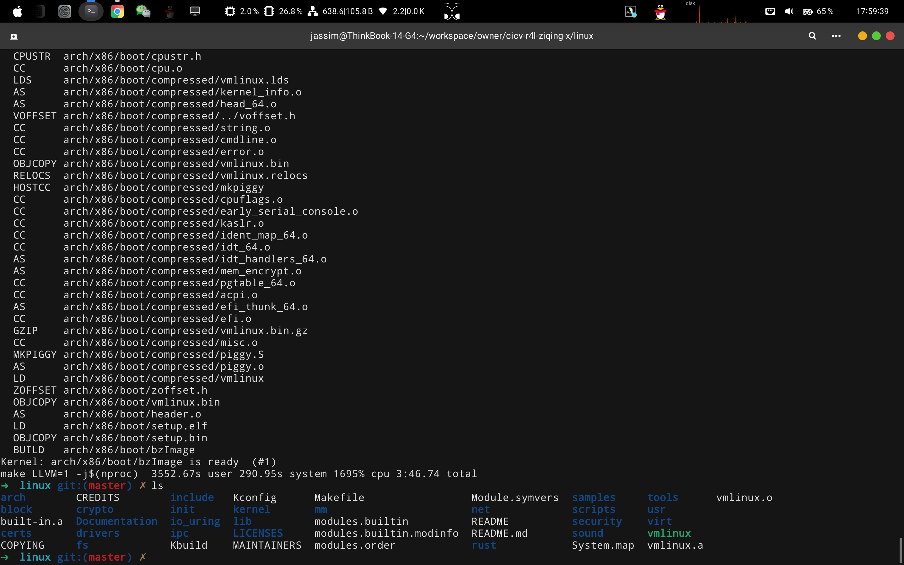

## 作业2-对Linux内核进行一些配置
+ 问题解答
  + 1、编译成内核模块，是在哪个文件中以哪条语句定义的？

```bash
答：Kbuild文件里的obj-m := r4l_e1000_demo.o
```
  + 2、该模块位于独立的文件夹内，却能编译成Linux内核模块，这叫做out-of-tree module，请分析它是如何与内核代码产生联系的？

```bash
答：Makefile里通过make的-C选项把当前工作目录转移到了linux目录下，内核的构建系统通过M=$$PWD 来定位独立模块的源代码，从而实现驱动的编译
```

- 编译e1000网卡驱动

```bash
make LLVM=1
```
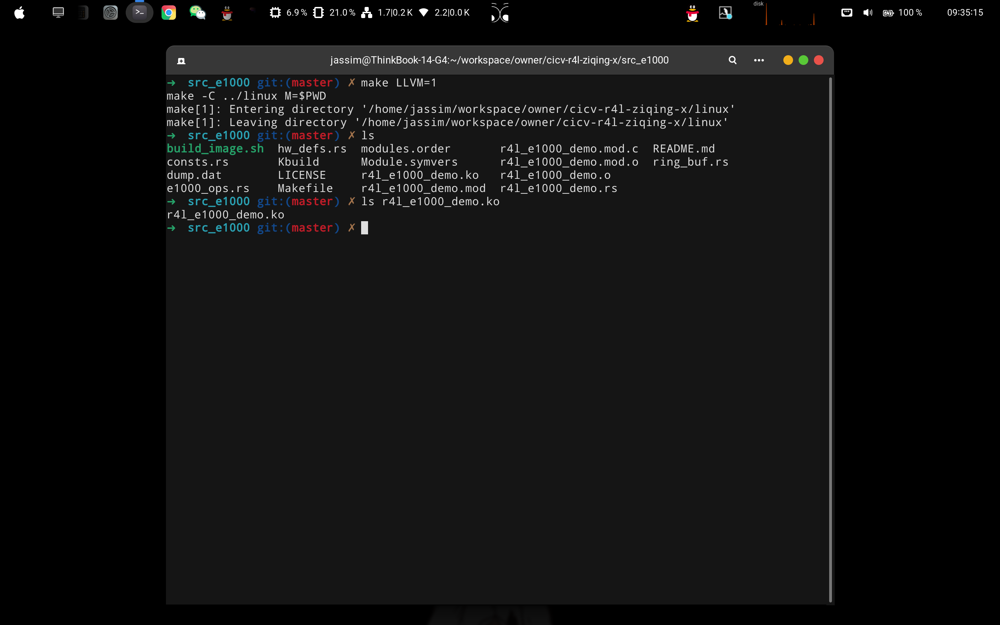

- 使用qemu运行作业一中编译的内核

```bash
cd src_e1000
chmod +x ./build_image.sh
./build_image.sh
ifconfig # 发现作业一的e1000网卡驱动被启用了
```


- 禁用Linux内核默认的C版本的e1000网卡驱动

```bash
Device Drivers 
    > Network device support
        > Ethernet driver support
            > Intel devices, Intel(R) PRO/1000 Gigabit Ethernet support
```
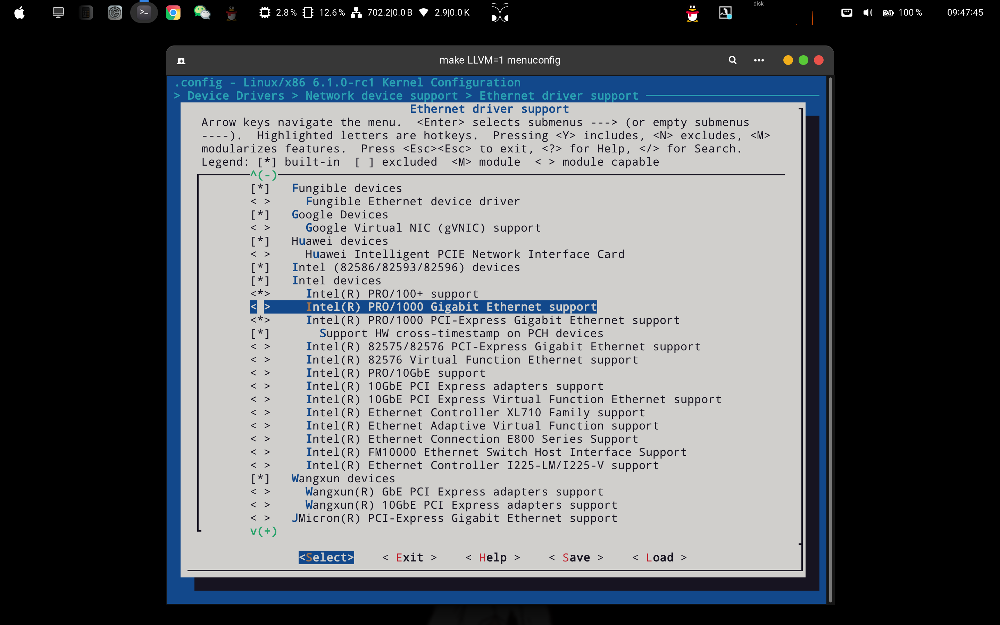


- 编译内核

```bash
make LLVM=1 -j$(nproc)
ls vmlinux
```
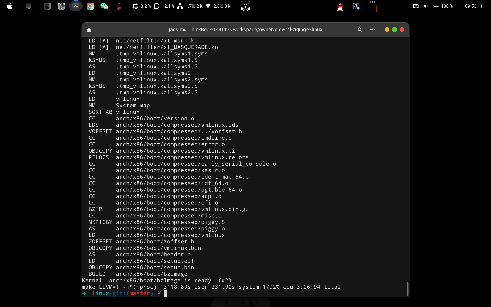

- 使用qemu运行刚编译的内核

```bash
./build_image.sh
ifcofig # 发现c语言写的驱动已经被禁用
```
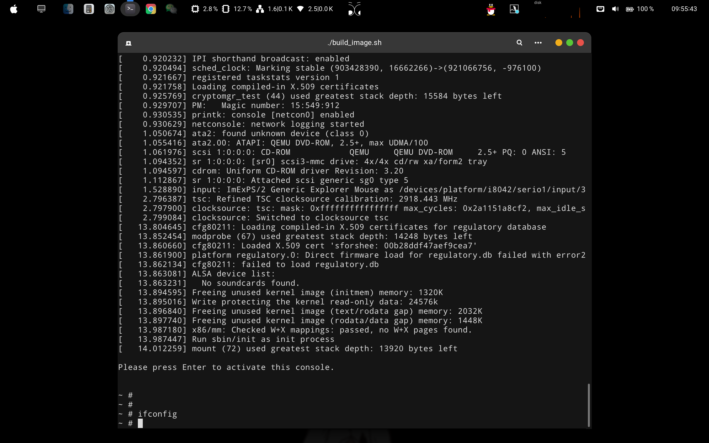


- 加载使用rust写的e1000网卡驱动

```bash
insmod r4l_e1000_demo.ko
```
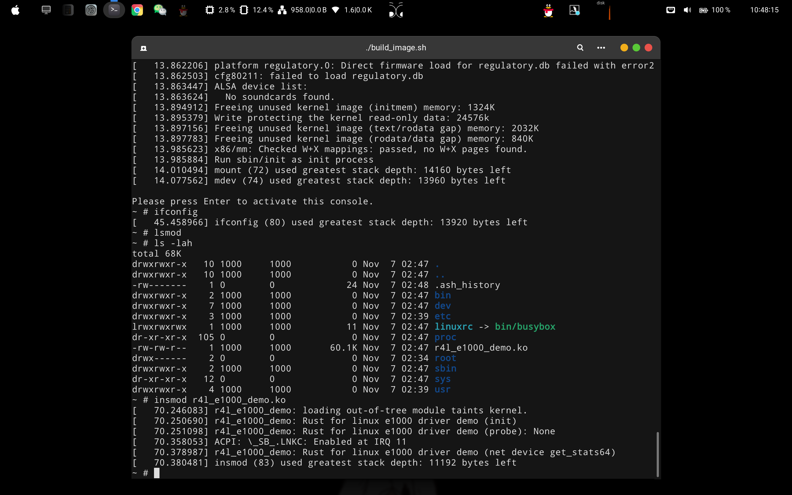

- 启用eth0网卡

```bash
ip link set eth0 up
```
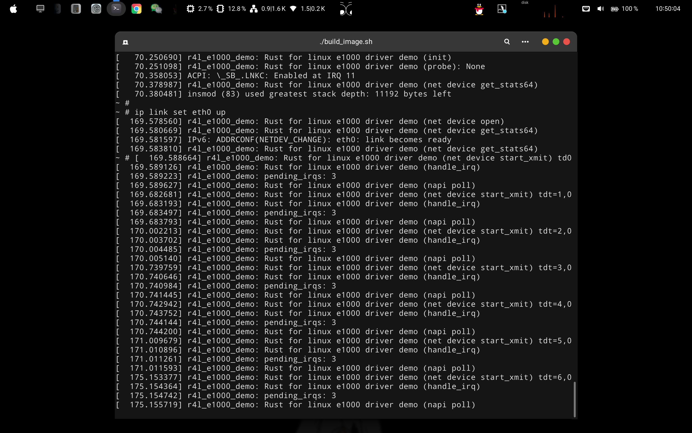

- 将广播IP地址（10.0.2.255）添加到eth0网络接口上

```bash
ip addr add broadcast 10.0.2.255 dev eth0
```
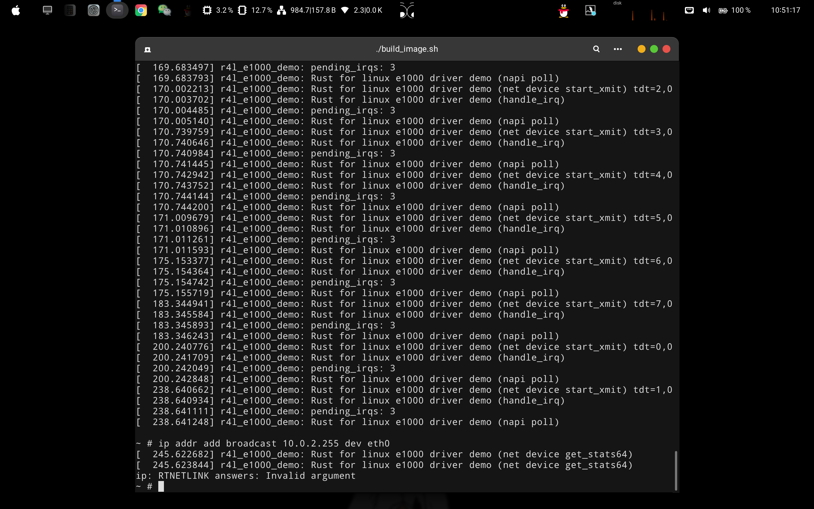

- 将IP地址 10.0.2.15 与子网掩码 255.255.255.0 分配给 eth0 网络接口

```bash
ip addr add 10.0.2.15/255.255.255.0 dev eth0
```
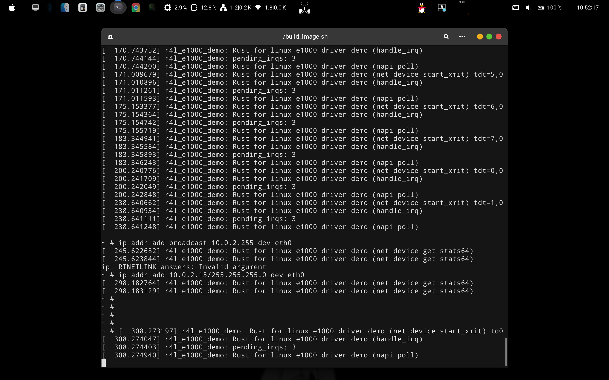

- 将默认路由设置为通过IP地址为10.0.2.1的网关进行转发

```bash
ip route add default via 10.0.2.1
```
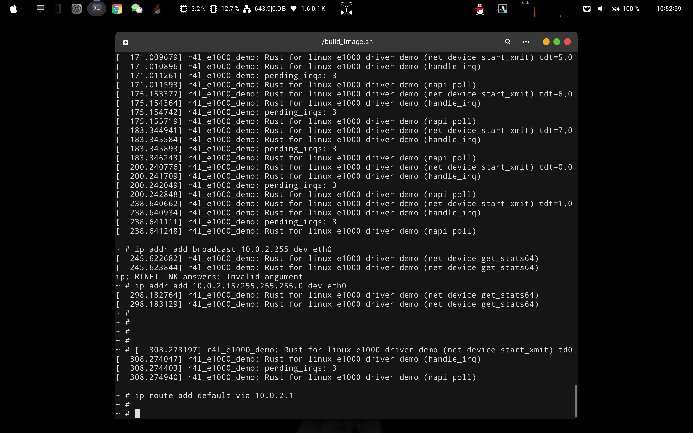

- 查看网口信息

```bash
ifconfig
```
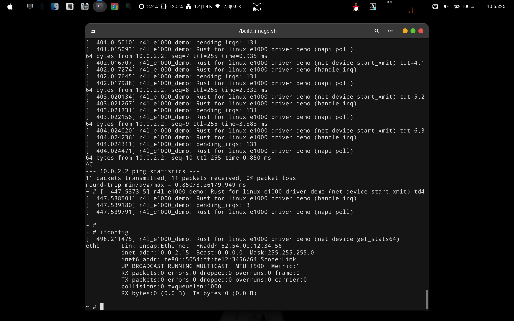

- 测试网络是否正常

```bash
ping 10.0.2.2
```
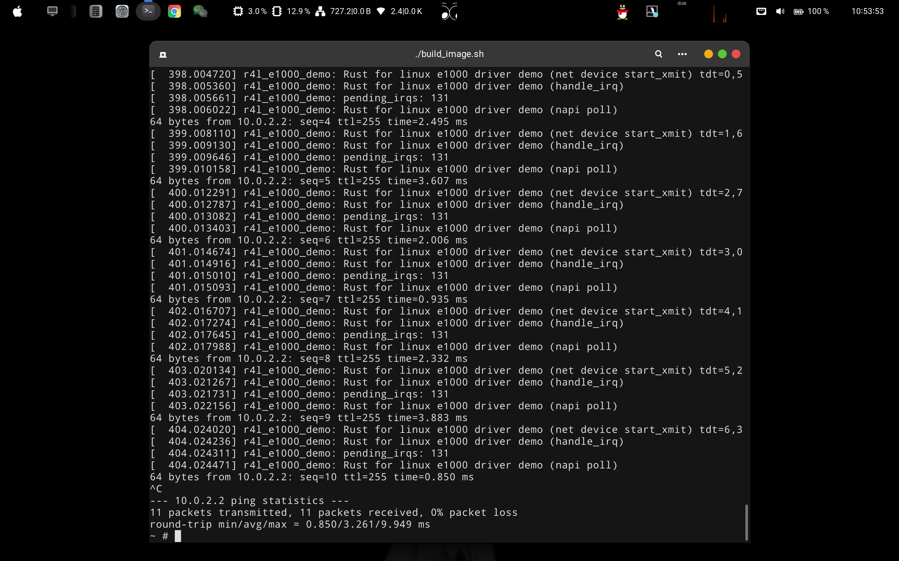

## 作业3-使用rust编写一个简单的内核模块并运行


## 作业4-为e1000网卡驱动添加remove代码


## 作业5-注册字符设备


## 结语
Enjoy :metal: