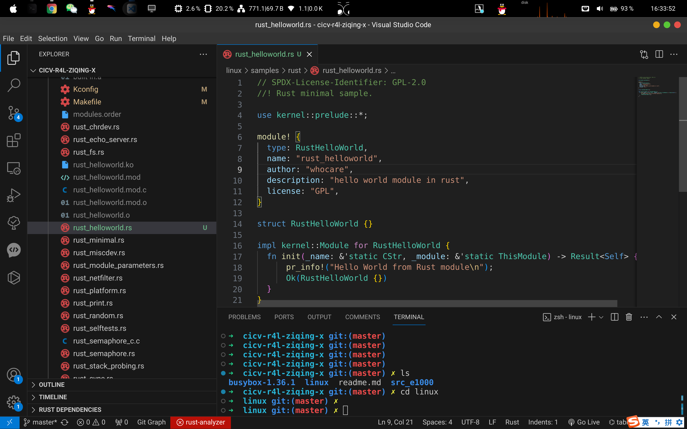
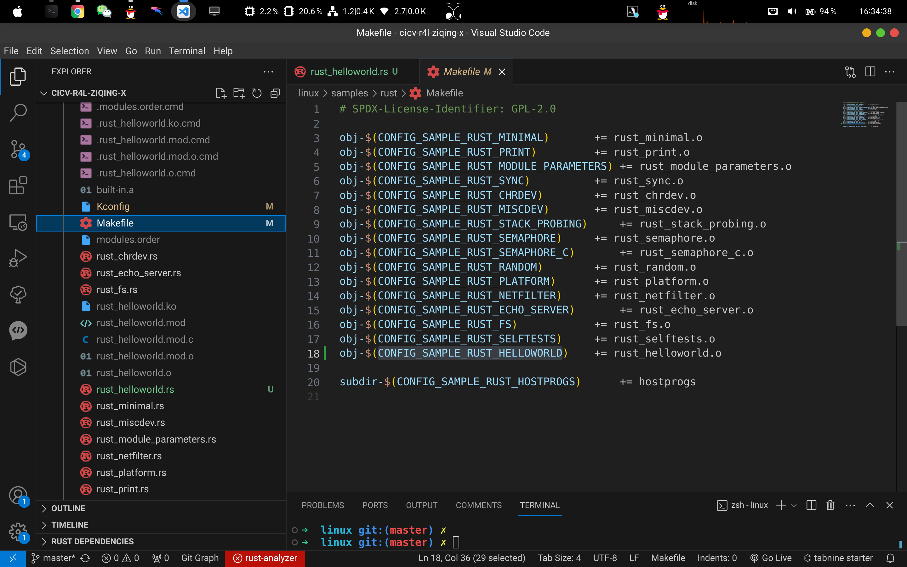
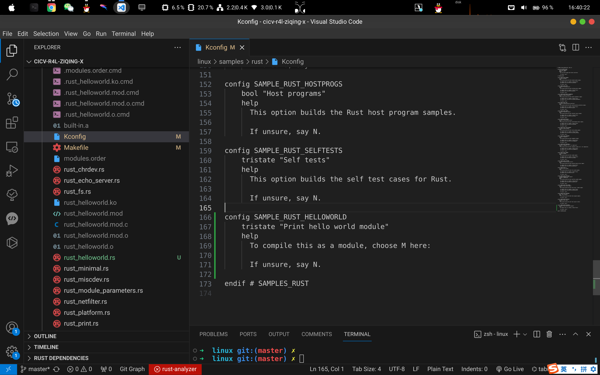
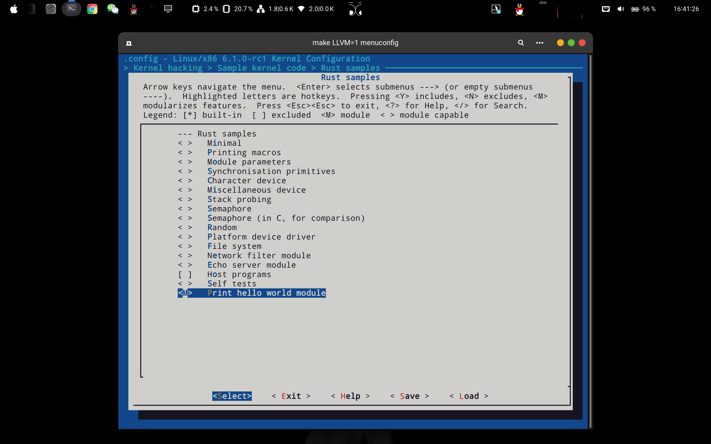
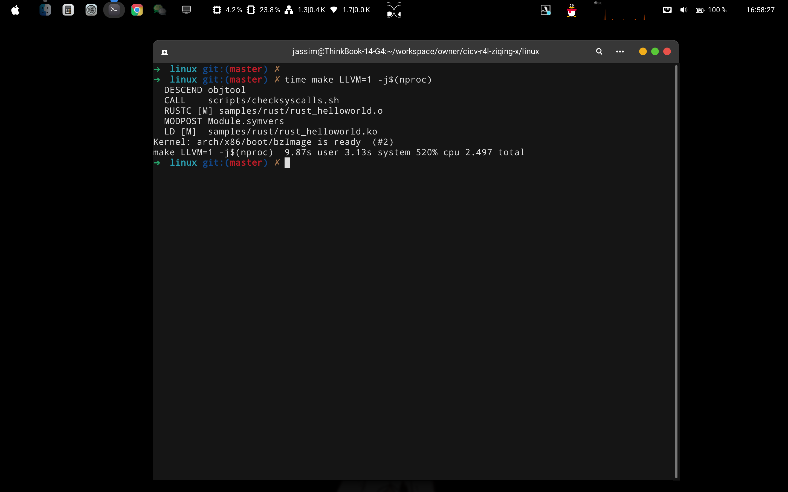
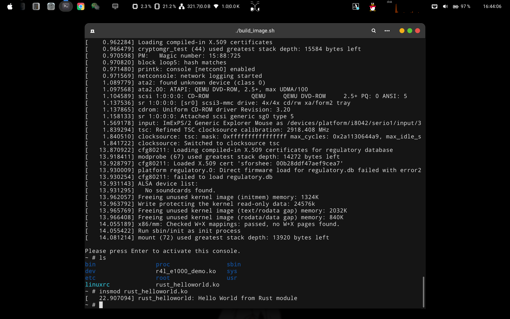
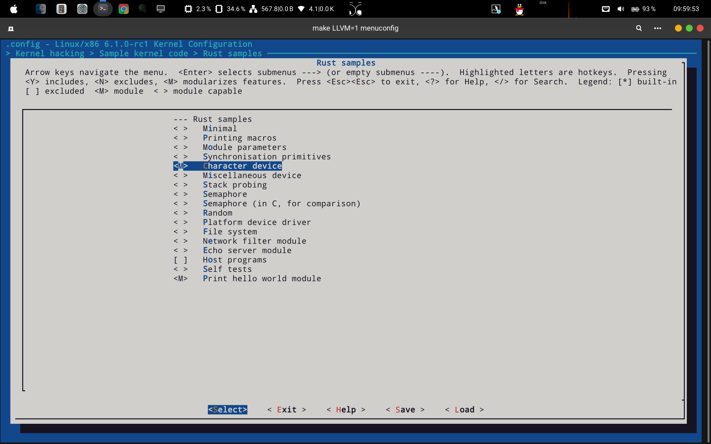
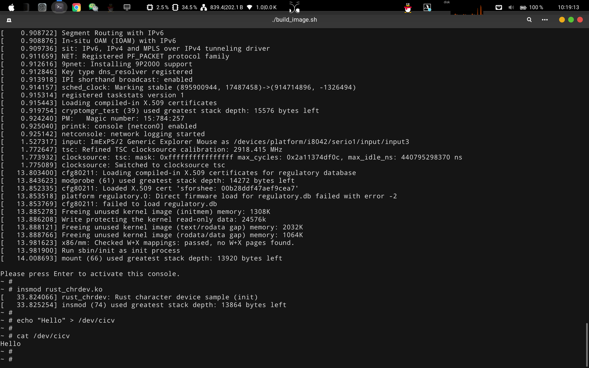
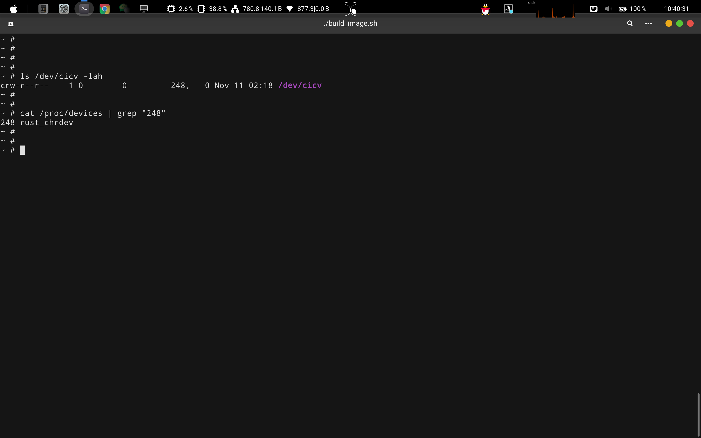

<p align="center">
  
  <h3 align="center">熊义</h3>
  <p align="center">
    第二阶段 rust for linux 作业报告
  <br>
</p>


## 索引

- [索引](#索引)
- [作业1-编译Linux内核](#作业1-编译linux内核)
- [作业2-对Linux内核进行一些配置](#作业2-对linux内核进行一些配置)
- [作业3-使用rust编写一个简单的内核模块并运行](#作业3-使用rust编写一个简单的内核模块并运行)
- [作业4-为e1000网卡驱动添加remove代码](#作业4-为e1000网卡驱动添加remove代码)
- [作业5-注册字符设备](#作业5-注册字符设备)
- [结语](#结语)

***
## 作业1-编译Linux内核

- 生成适用于x86_64架构的默认配置

```bash
cd linux
make x86_64_defconfig
```

- 配置内核对Rust语言的支持

```bash
make LLVM=1 menuconfig
General setup
        ---> [*] Rust support
```


- 编译内核

```bash
make LLVM=1 -j$(nproc)
ls vmlinux
```


***

## 作业2-对Linux内核进行一些配置

- 编译e1000网卡驱动

```bash
make LLVM=1
```


- 使用qemu运行作业一中编译的内核

```bash
cd src_e1000
chmod +x ./build_image.sh
./build_image.sh
ifconfig # 发现作业一的e1000网卡驱动被启用了
```


- 禁用Linux内核默认的C版本的e1000网卡驱动

```bash
make LLVM=1 menuconfig

Device Drivers 
    ---> Network device support
        ---> Ethernet driver support
            ---> Intel devices, Intel(R) PRO/1000 Gigabit Ethernet support
```


- 编译内核

```bash
make LLVM=1 -j$(nproc)
ls vmlinux
```


- 使用qemu运行刚编译的内核

```bash
./build_image.sh
ifcofig # 发现c语言写的驱动已经被禁用
```


- 加载使用rust写的e1000网卡驱动

```bash
insmod r4l_e1000_demo.ko
```


- 启用eth0网卡

```bash
ip link set eth0 up
```


- 将广播IP地址（10.0.2.255）添加到eth0网络接口上

```bash
ip addr add broadcast 10.0.2.255 dev eth0
```


- 将IP地址 10.0.2.15 与子网掩码 255.255.255.0 分配给 eth0 网络接口

```bash
ip addr add 10.0.2.15/255.255.255.0 dev eth0
```


- 将默认路由设置为通过IP地址为10.0.2.1的网关进行转发

```bash
ip route add default via 10.0.2.1
```


- 查看网口信息

```bash
ifconfig
```


- 测试网络是否正常

```bash
ping 10.0.2.2
```


+ 问题1、编译成内核模块，是在哪个文件中以哪条语句定义的？

```bash
答：Kbuild文件里的obj-m := r4l_e1000_demo.o
```
+ 问题2、该模块位于独立的文件夹内，却能编译成Linux内核模块，这叫做out-of-tree module，请分析它是如何与内核代码产生联系的？

```bash
答：Makefile里通过make的-C选项把当前工作目录转移到了linux目录下，内核的构建系统通过M=$$PWD 来定位独立模块的源代码，从而实现驱动的编译
```

***

## 作业3-使用rust编写一个简单的内核模块并运行

- 进入到Linux目录下samples/rust文件夹
- 添加一个rust_helloworld.rs文件
- 在该文件中添加如下内容

```Rust
// SPDX-License-Identifier: GPL-2.0
//! Rust minimal sample.
      
use kernel::prelude::*;
      
module! {
  type: RustHelloWorld,
  name: "rust_helloworld",
  author: "whocare",
  description: "hello world module in rust",
  license: "GPL",
}
      
struct RustHelloWorld {}
      
impl kernel::Module for RustHelloWorld {
  fn init(_name: &'static CStr, _module: &'static ThisModule) -> Result<Self> {
      pr_info!("Hello World from Rust module");
      Ok(RustHelloWorld {})
  }
}
```


- 修改Makefile

```Makefile
# 在倒数第二行追加这行代码
obj-$(CONFIG_SAMPLE_RUST_HELLOWORLD)	+= rust_helloworld.o
```


- 修改Kconfig

```bash
# 在倒数第二行添加下面代码
config SAMPLE_RUST_HELLOWORLD
	tristate "Print hello world module"
	help
	  To compile this as a module, choose M here:

	  If unsure, say N.
```


- 更改该模块的配置，使之编译成模块

```bash
Kernel hacking
  ---> Sample Kernel code
      ---> Rust samples
              ---> <M>Print Helloworld in Rust (NEW)
```


- 编译内核

```bash
time make LLVM=1 -j$(nproc)
```


- 在qemu环境运行驱动

```bash
cp linux/samples/rust/rust_helloworld.ko src_e1000/rootfs
cd src_e1000 && ./build_image.sh
# 系统起来后
insmod rust_helloworld.ko
```


***

## 作业4-为e1000网卡驱动添加remove代码

***

## 作业5-注册字符设备

- 更改配置

```bash
Kernel hacking
  ---> Sample Kernel code
      ---> Rust samples
              ---> <*>Character device (NEW)
```


- 编译并运行

```bash
make LLVM=1 -j$(nproc)
cp samples/rust/rust_chrdev.ko ../src_e1000/rootfs/
cd ../src_e1000/
./build_image.sh
```


- 加载驱动并验证结果

```bash
insmod rust_chrdev.ko
echo "Hello" > /dev/cicv
cat /dev/cicv
```


- 问题1、作业5中的字符设备/dev/cicv是怎么创建的？

```bash
答: 作业5中的字符设备/dev/cicv是在Linux的启动脚本/etc/init.d/rcS.sh里通过mknod /dev/cicv c 248 0命令创建的。
```
- 问题2、它的设备号是多少？

```bash
答: /dev/cicv的主设备号是248, 次设备号是0。
```
- 问题3、它是如何与我们写的字符设备驱动关联上的？

```bash
答: 通过设备号248进行关联的。
```



***

## 结语
纸上得来终觉浅，绝知此事要躬行 :metal: